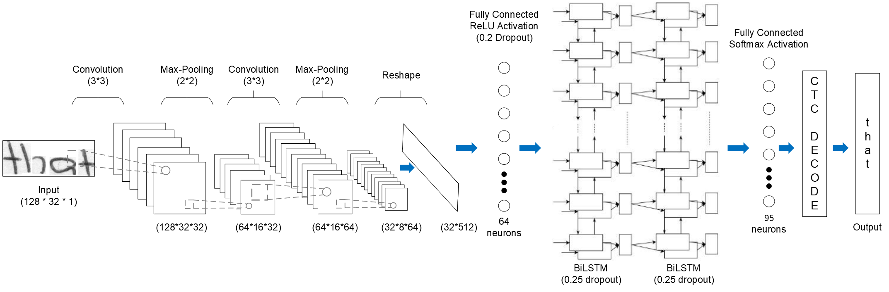

# Handwritten-Document-Conversion

## Introduction
This project aims to digitize handwritten content, transforming it into machine-readable text. By using advanced machine learning and computer vision techniques, the goal is to develop a system that can accurately recognize and convert handwritten documents. This will enhance accessibility and enable efficient data processing, facilitating the transition from physical to digital records. The project aims to ensure that handwritten notes, forms, and documents can be easily stored, searched, and utilized in various digital applications.
## Goals
1. Develop a system that accurately recognizes and converts various styles of handwritten content into digital text, ensuring high precision and reliability.
2. Create a user-friendly interface to use the system
## Contributors
- Nimesh Gopal Pradhan
- Nikin Baidar
## Project Architecture

# Status
- Trained word detection model in tensorflow using CNN and LSTM with CTC loss for 50 epochs.  
- Word Segmentation is done through YOLOv10 nano model trained to recognize words.
## Known Issue
1) Word detection model is not perfect.  
2) Does not work properly on complex handwriting or complex layout of texts.
## High Level Next Steps
1) Train better word detection model using other deep learning methods like transfomers.  
2) Currently work on unstructured text but need to trained layout parser to work on structured texts like forms, tabular data and return result in json format.
# Usage
## Installation
To begin this project, use the included `Makefile`

#### Creating Virtual Environment

This package is built using `python-3.8`. 
We recommend creating a virtual environment and using a matching version to ensure compatibility.

#### pre-commit

`pre-commit` will automatically format and lint your code. You can install using this by using
`make use-pre-commit`. It will take effect on your next `git commit`

#### pip-tools

The method of managing dependencies in this package is using `pip-tools`. To begin, run `make use-pip-tools` to install. 

Then when adding a new package requirement, update the `requirements.in` file with 
the package name. You can include a specific version if desired but it is not necessary. 

To install and use the new dependency you can run `make deps-install` or equivalently `make`

If you have other packages installed in the environment that are no longer needed, you can you `make deps-sync` to ensure that your current development environment matches the `requirements` files. 

## Usage Instructions

# Data Source
## Code Structure
## Artifacts Location

# Results
## Metrics Used
## Evaluation Results
